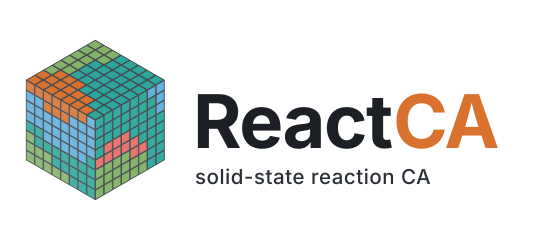

<p align="center">
  
</p>

A lattice model for simulating solid state reactions.

[](https://mcgalcode.github.io/rxn-ca)

## Overview

`rxn-ca` is a Python library for predicting the outcome of solid-state synthesis reactions using a cellular automaton approach. It uses thermodynamic data from the [Materials Project](https://next-gen.materialsproject.org/) to enumerate possible reactions and simulate phase evolution during synthesis.

## Installation

```bash
git clone https://github.com/mcgalcode/rxn-ca.git
cd rxn-ca
pip install -e .
```

For optional features:

```bash
pip install -e ".[optimization]"  # Bayesian/genetic optimization
pip install -e ".[workflow]"      # Jobflow integration
pip install -e ".[vis]"           # Visualization tools
```

## Quick Start

```python
from rxn_ca.core.recipe import ReactionRecipe
from rxn_ca.core.heating import HeatingSchedule, HeatingStep

# Define reactants (mole ratios)
reactants = {"MgO": 1, "Al2O3": 1}

# Create heating schedule
heating_schedule = HeatingSchedule.build(
    HeatingStep.sweep(500, 1600, stage_length=1, temp_step_size=50),
    HeatingStep.hold(1600, stage_length=20)
)

# Create recipe
recipe = ReactionRecipe(
    reactant_amounts=reactants,
    heating_schedule=heating_schedule
)
```

## Documentation

Full documentation is available at **[mcgalcode.github.io/rxn-ca](https://mcgalcode.github.io/rxn-ca)**

- [Getting Started](https://mcgalcode.github.io/rxn-ca/getting-started/) - Installation and setup
- [Basic Usage](https://mcgalcode.github.io/rxn-ca/guides/basic-usage/) - Complete simulation walkthrough
- [Using Jobflow](https://mcgalcode.github.io/rxn-ca/guides/jobflow/) - Parallel simulations on HPC

## Requirements

- Python >= 3.9
- Materials Project API key ([get one here](https://next-gen.materialsproject.org/api))

## License

BSD-3-Clause
